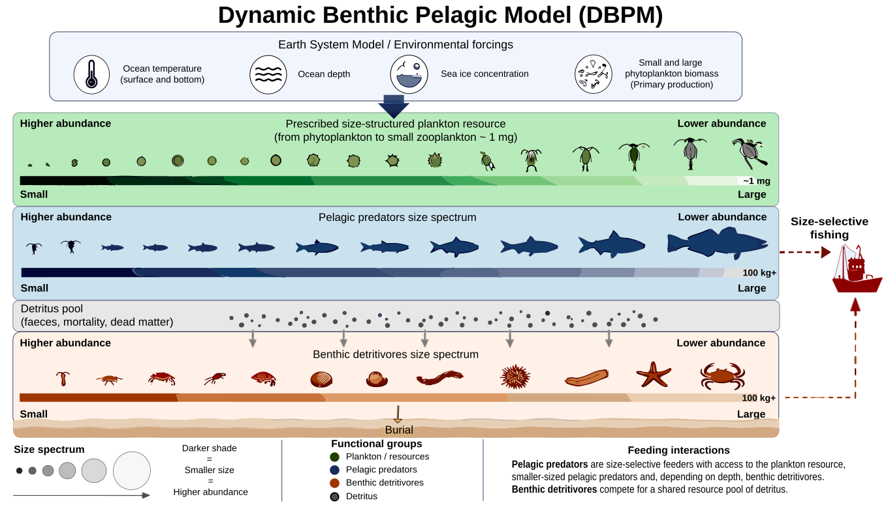

# dbpmr

R implementation of the Dynamic Benthic Pelagic Model (DBPM) with spatial size-spectrum capabilities.

*Schematic of the Dynamic Benthic-Pelagic Size Spectrum Model (DBPM): environmental inputs (top left)
drive the size-structured dynamics of pelagic predators and benthic detritivores, shaping biomass flows,
fish production, and ecosystem responses.*

## Forcing inputs (Earth System Model variables)

DBPM is driven by outputs from an Earth System Model (ESM; e.g. GFDL-MOM6-COBALT2 in ISIMIP3a/FishMIP,
monthly). These raw variables are processed into the model's forcing — the plankton size spectrum,
temperature effects, and detritus/export supply:

| ESM variable | dims | units | used for |
|---|---|---|---|
| `phyc` — total phytoplankton carbon | 3D (lon, lat, depth, time) | mol m⁻³ | plankton size-spectrum **intercept & slope**; vertical biomass weights |
| `phypico` — picophytoplankton carbon | 3D | mol m⁻³ | small-vs-large phyto split → spectrum **slope** |
| `thetao` — ocean temperature | 3D | °C | pelagic (water-column / experienced) temperature effect |
| `tob` — sea-floor temperature | 2D | °C | benthic temperature effect |
| `tos` — sea-surface temperature | 2D | °C | surface temperature effect; export-ratio formula |
| `intpp` — integrated primary production | 2D | mol m⁻² s⁻¹ | export-ratio denominator |
| `expc-bot` — carbon export flux to seafloor | 2D | mol m⁻² s⁻¹ | export ratio → benthic detritus supply |
| `deptho` — ocean depth (bathymetry) | 2D static | m | depth channel / pelagic-benthic coupling |
| `thkcello` — layer thickness | 3D static | m | weights for vertical integration of the 3D fields |
| `siconc` — sea-ice concentration | 2D | % | sea-ice gate on fishing effort (gridded runs only) |

Plus cell **area** (m²) for aggregating per-cell densities. Derivations: `intercept, slope` from
`GetPPIntSlope(phyc, phypico)`; export ratio ≈ `expc-bot / intpp`; temperature effects from `thetao` /
`tob`. **Note:** the depth-resolved (3D) `phyc`/`phypico`/`thetao` are needed for the vertically
biomass-weighted method; the standard method can instead use the ESM's vertically-integrated
`phyc-vint`/`phypico-vint` (mol m⁻²) with surface `tos`.

## Legacy package name

This package was historically named `SizeSpectra` and has been renamed to `dbpmr` for consistency with DBPM usage.
